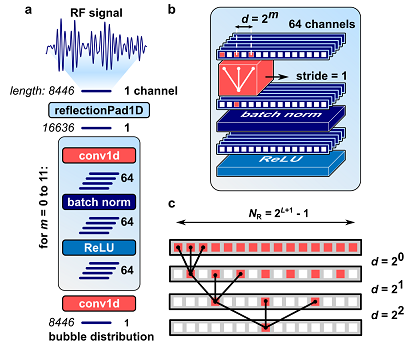
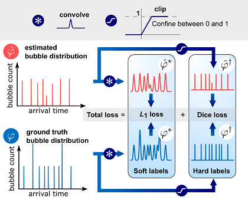
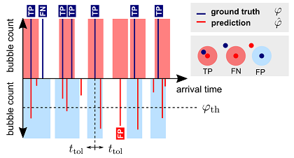

# Neural network training and evaluation

## Neural network architecture

The network architecture is described in detail in Section II-B of the *IEEE TMI* article.

**Fig. 3. Architecture of the dilated convolutional neural network. a** *Architecture overview, showing a 1D reflection padding layer, 1D convolutional layers, batch normalization layers and Rectified Linear Unit (ReLU) activation layers.* **b** *Detailed illustration of the three-layer block outlined in a for m = 1, showing the convolution kernel, the stride, and the dilation rate d.* **c**. *Stack of convolutional layers illustrating the exponential expansion of the receptive field NR as a function of the number of convolutional layers L.*

The neural network is implemented in `bubblenetwork.py`.

## Neural network training

The dual-loss function and training procedure are described in detail in Section II-C of the *IEEE TMI* article.

**Fig. 4. Dual-loss function.** *The ground truth label is convolved with a Gaussian kernel to generate a soft label. In parallel, the ground truth label is clipped to produce a binary label. The same operations are applied to the network output to generate a soft prediction and a binary prediction. The total loss is a linear combination of an L1 loss, and a Dice loss.*

The dual-loss function is implemented in `bubblelossfunctions.py`.

Network training is implemented with the following files:

* `Training_H.py`
* `Training_HS_001.py`
* `Training_HS_01.py`
* `Training_HS_1.py`
* `Training_S_001.py`
* `Training_S_01.py`
* `Training_S_1.py`
* `Training_HS_001_noise_1%.py`	Trained with added noise, see the folder `code_copies` for other noise levels.
* `Training_HS_001_polydisperse.py` Trained on polydisperse data set

The trained neural networks are stored in these folders:

* 📂 `modelH`
* 📂 `modelHS_001`
* 📂 `modelHS_01`
* 📂 `modelHS_1`
* 📂 `modelS_001`
* 📂 `modelS_01`
* 📂 `modelS_1`
* 📂 `modelHS_001_polydisperse`
* 📂 `model_noise`

## Model evaluation

**Fig. 5. Model evaluation with localization tolerance.** *The detection threshold classifies predictions either as positives or negatives. The tolerance radius defines a tolerance region centered at a microbubble. A ground truth bubble that falls within the tolerance region of any predicted bubble counts as a true positive (TP). A ground truth bubble that does not fall within the tolerance interval of any predicted bubble counts as a false negative (FN). A predicted bubble that does not fall within the tolerance region of any ground truth bubble counts as a false positive (FP).*

The evaluation metrics are implemented in `bubblemetrics.py`.

Threshold optimization is implemented in:

* `ThresholdOptimization.py` Threshold optimisation of model HS_01, for other models, see `code_copies`.
* `ThresholdOptimization_noise_1%.py` Threshold optimisation of model trained with 1% noise, for other noise levels see `code_copies`.
* `ThresholdOptimization_polydisperse.py` Threshold optimisation of model trained on polydisperse data.

The optimal thresholds are stored in:

* 📂 `modelH`
* 📂 `modelHS_001`
* 📂 `modelHS_01`
* 📂 `modelHS_1`
* 📂 `modelR`
* 📂 `modelS_001`
* 📂 `modelS_01`
* 📂 `modelS_1`
* 📂 `modelHS_001_polydisperse`
* 📂 `model_noise`

After threshold optimization, the models are evaluated with:

* `ModelComparison.py` Compare model performance
* `ModelComparison_noise.py` Compare model performance for different noise levels (no retraining modelHS_001)
* `ModelComparison_polydisperse.py` Compare models trained on polydispsere and monodisperse data sets.

The evaluation results are stored in:

* 📂 `ModelComparison`

## Figure generation
Code used to create the figures in the article.

### Fig. 6
* `ModelOutputPlot.py` 

### Fig. 7a
* `PrecisionRecallTradeOff.py` Compute precision and recall for a range of thresholds and tolerances.	
* 📂 `PrecisionRecall` Precision, recall, and F1 score for a range of localisation tolerances and thresholds
* `PrecisionRecallPlot.py`

### Fig. 7b
* `ModelComparisonPlot.py` Used for Fig. 7b

### Fig. 8
* `StatisticsNumberBubbles.py` Compute F1 score for each sample in the test set
* 📂 `Statistics_HS_001` F1 score for a range of acoustic pressures and number of bubbles

* `StatisticsNumberBubblesPlot.py` 

### Fig. 10 
* `Resolve2D.py` Resolve 2D RF data (line by line deconvolution with trained neural network)

### Fig. 11
* `ModelComparisonPlot_noise.py` Used for making Fig. 11

## OTHER FILES
* `bubbledataloader.py` Load data from .txt files
* `bubbledataloadermatlab.py` Load data from .mat files
* `bubblelogging.py` Track loss during training
* `customcolormaps.py` Custom colormaps with manuscript colours
* `DataSetSizeComparsion.py` Used for making Fig. S2
* 📂 `datasetsize` to study effect of training set size, 	generated with `code_copies`\ `Training_HS_01_*train.py`

