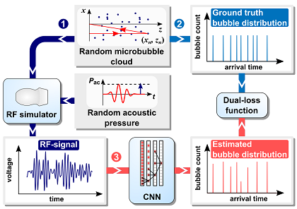

# Super-Resolved Microbubble Localization in Single-Channel Ultrasound RF Signals Using Deep Learning

This repository contains all the code necessary to reproduce the results presented in the article: N. Blanken, J. M. Wolterink, H. Delingette, C. Brune, M. Versluis and G. Lajoinie, "Super-Resolved Microbubble Localization in Single-Channel Ultrasound RF Signals Using Deep Learning," in _IEEE Transactions on Medical Imaging_, doi: 10.1109/TMI.2022.3166443.

Link to the article: https://ieeexplore.ieee.org/document/9755198

**Fig. 1** **Methods overview.** **1** *A randomly distributed microbubble cloud (random number of bubbles and random coordinates) serves as input to a simulator that generates one-dimensional (1D) RF signals. The individual bubble radii are drawn from a narrow (monodisperse) distribution. The acoustic pressure amplitude is also randomly selected.* **2** *The bubble coordinates are also used to compute the 1D ground truth distributions (arrival times of bubble echoes).* **3** *A 1D dilated convolutional neural network (CNN) is trained with a dual-loss function to detect and localize microbubbles in an RF signal.*

The code is organized into three folders:
* 📂 **RF_simulator:** RF signal simulation and ground truth generation (Fig. 1, step 1 and 2). Section II.A in the article.
* 📂 **Network:**      Neural network training and evaluation (Fig. 1, step 3). Sections II.B, II.C, II.D.1 in the article.
* 📂 **DelayAndSum:**  Delay-and-sum image reconstruction with unprocessed and deconvolved RF signals. Section II.D.2 in the article.

## Required software

* RF_simulator: MATLAB with Signal Processing Toolbox
* Network: Python with PyTorch, NumPy, Matplotlib, SciPy
* DelayAndSum: MATLAB

## License and citation

This code is available under an MIT licencse. If you use (parts of) the code, please cite our IEEE TMI article:

N. Blanken, J. M. Wolterink, H. Delingette, C. Brune, M. Versluis and G. Lajoinie, "Super-Resolved Microbubble Localization in Single-Channel Ultrasound RF Signals Using Deep Learning," in *IEEE Transactions on Medical Imaging*, doi: 10.1109/TMI.2022.3166443.

    @article{9755198,
        author={Blanken, Nathan and Wolterink, Jelmer M. and Delingette, Hervé and Brune, Christoph and Versluis, Michel and Lajoinie, Guillaume},
        journal={IEEE Transactions on Medical Imaging}, 
        title={Super-Resolved Microbubble Localization in Single-Channel Ultrasound RF Signals Using Deep Learning}, 
        year={2022},
        volume={},
        number={},
        pages={1-1},
        doi={10.1109/TMI.2022.3166443}
    }

