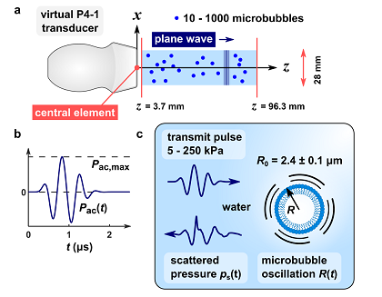

# RF signal simulator

The RF signal simulator is described in detail in Section II.A of the *IEEE TMI* article.

**Fig. 2. RF signal simulator. a** *For each simulation, the number of microbubbles is randomly selected. The bubbles are randomly distributed in a two-dimensional domain. A virtual P4-1 transducer emits a short-pulse plane wave which excites the bubbles. All bubble echoes arriving at the center element are added up and convolved with the receive impulse response of the transducer to produce an RF signal.* **b** *Pulse shape. For each simulation, the acoustic pressure is randomly selected.* **c** *Each bubble is assigned a random radius. The radial oscillation R(t) is computed by solving a Rayleigh-Plesset equation. From R(t), the scattered pressure is computed.*

## File overview
### Main RF simulator files
* `main.m` RF signal simulator (1D data, monodisperse size distribution), used for Figs. 6, 7, 8.
* `main_2D.m` RF signal simulator (2D data, monodisperse size distribution), used for Fig. 10.
* `main_polydisperse.m RF signal simulator` (1D data, polydisperse size distribution), used for Fig. 11.
* `VariablesList.m`	Overview of simulation parameters and variables.
* `VisualiseRF`	Visualise simulation results.
* `writeResultsToTxt.m`	Convert RF simulation results to .txt files for network training, validation, and testing.
* `writeResultsToTxt_polydisperse.m` Same as writeResultsToTxt, but for polydisperse data set.

### Single-bubble RF simulator files
* `RF_single_bubble.m` Simulate the response of a single bubble for a range of acoustic pressures, used for Fig. 9.
* `RF_single_bubble_single.m` Simulate the response of a single bubble, one RF signal only.
* `SingeBubbleHarmonicContent.m` Visualize the response of a single bubble for a range of acoustic pressures, used for Fig. 9.

### Functions used in the RF simulator:
* `calcBubbleResponse.m` Calculate the radial response of a single bubble.
* `getPolydisperseDistribution.m` Get polydisperse size distribution P(R) of SonoVue.
* `getBubblesPolydisperse.m` Get bubbles with random radius from distribution P(R).	
* `getRandomRadius.m` Get a random radius from distribution P(R).

### Folders:
* 📂 `ColorMapMaker` Files for custom colormap with colours from manuscript.
* 📂 `extra_files`	Plot transfer functions, estimate resonance radius microbubble.
* 📂 `functions` Function used in the RF simulator.
* 📂 `SingleBubbles` RF data for a single bubble for a range of acoustic pressures, generated with RF_single_bubble.m, used for Fig. 9.
